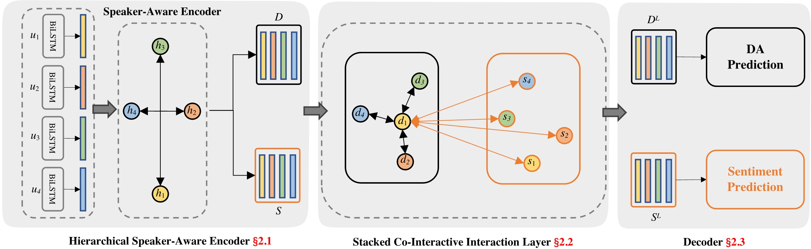

# Co-GAT
This repository contains the PyTorch implementation of the paper: 

**[Co-GAT: A Co-Interactive Graph Attention Network for Joint Dialog Act
Recognition and Sentiment Classification](https://ojs.aaai.org/index.php/AAAI/article/view/17616)**. 
Libo Qin, Zhouyang Li, Wanxiang Che, Minheng Ni, Ting Liu. 
***AAAI 2021***.

## Architecture



## Requirements
Our code relies on Python 3.6 and following libraries:
- transformers==3.3.0
- torch==1.1.0
- numpy==1.19.1
- tqdm==4.49.0
- scikit_learn==0.23.2
- pytorch-pretrained-bert==0.6.2 (used to load the best model provided)

## Run 
We will teach you how to run our code step by step.

### Quick start
The script **main.py** acts as a main function to the project, you can run the experiments by the following commands.

  ``` shell script
    # Mastodon
    CUDA_VISIBLE_DEVICES=$1 python -u main.py -ed 800 -sd save/mastodon -dd dataset/mastodon
  
    # Dailydialogue
    CUDA_VISIBLE_DEVICES=$1 python -u main.py -bs 32 -ne 100 -dr 0.07 -gl 3 -sd save/dailydialogue -dd dataset/dailydialogue
  ```

Due to some stochastic factors(e.g., GPU and environment), it maybe need to slightly tune the hyper-parameters using grid search to reproduce the results reported in our paper.
Here are the suggested hyper-parameter settings:
  > + batch_size [16, 32]    
  > + gat_layer [2, 3, 4]
  > + embedding_dim [128, 256, 400, 512, 600, 800, 1024]
  > + hidden_dim [256, 400, 512, 600, 800, 1024]
  > + dropout_rate [0.07, 0.1, 0.14, 0.2, 0.3]
  > + gat_dropout_rate [0.07, 0.1, 0.14, 0.2, 0.3]


### Pre-trained Model
You can use the `--pretrained_model` parameter in **main.py** to control the type of pretrained model.
And `--bert_learning_rate` parameter ti control the learning rate of the pretrained model.
We provide interfaces for these models: [BERT, RoBERTa, XLNet, ALBERT, ELECTRA]
You can write command like this:
``` shell script
  # Mastodon
  CUDA_VISIBLE_DEVICES=$1 python -u main.py -pm roberta -blr 2e-6 -bs 1 -ne 200 -sd save/mastodon-roberta -dd dataset/mastodon
  
  # Dailydialogue
  CUDA_VISIBLE_DEVICES=$1 python -u main.py -pm bert -sd save/dailydialogue-bert -dd dataset/dailydialogue
```


### Loading the Best model provided
Please note that 
1. Whether using a pre-trained model or not, our code will execute word piece padding every time it runs.
    And we use the pytorch-pretrained-bert as the pretrained model library when we conducted the main experiment. 
    But it has now become [transformers](https://github.com/huggingface/transformers). 
    
    > So when you loading the best model that we provided in `save/` directory, you need to implement pytorch-pretrained-bert==0.6.2
2. We refactored the code after migrating to transformers. So the saved models didn't have some args.
    So you can find some method to set those args. 
    And don’t worry, these codes will not be called during formal training and will not affect the final result.
    
For loading the best model and get the results reported in our paper. Please use:

  ``` shell script
    # Mastodon
    CUDA_VISIBLE_DEVICES=$1 python -u test_model.py -sd save/mastodon -dd dataset/mastodon

    # Dailydialogue
    CUDA_VISIBLE_DEVICES=$1 python -u test_model.py -bs 32 -sd save/dailydialogue -dd dataset/dailydialogue
   ```


## Citation
If you use any source codes included in this repo in your work, please cite the following paper. 
The bibtex is listed below:

<pre>
@inproceedings{qin2021co,
  title={Co-GAT: A Co-Interactive Graph Attention Network for Joint Dialog Act Recognition and Sentiment Classification},
  author={Qin, Libo and Li, Zhouyang and Che, Wanxiang and Ni, Minheng and Liu, Ting},
  booktitle={Proceedings of the AAAI Conference on Artificial Intelligence},
  volume={35},
  number={15},
  pages={13709--13717},
  year={2021}
}
</pre>

## Issues/PRs/Questions 
Feel free to contact [me](mailto:zhouyangli@ir.hit.edu.cn) for any questions or create issues/prs.

## Acknowledgement
https://github.com/Diego999/pyGAT

We are very grateful for their pytorch implementation of GAT!!
